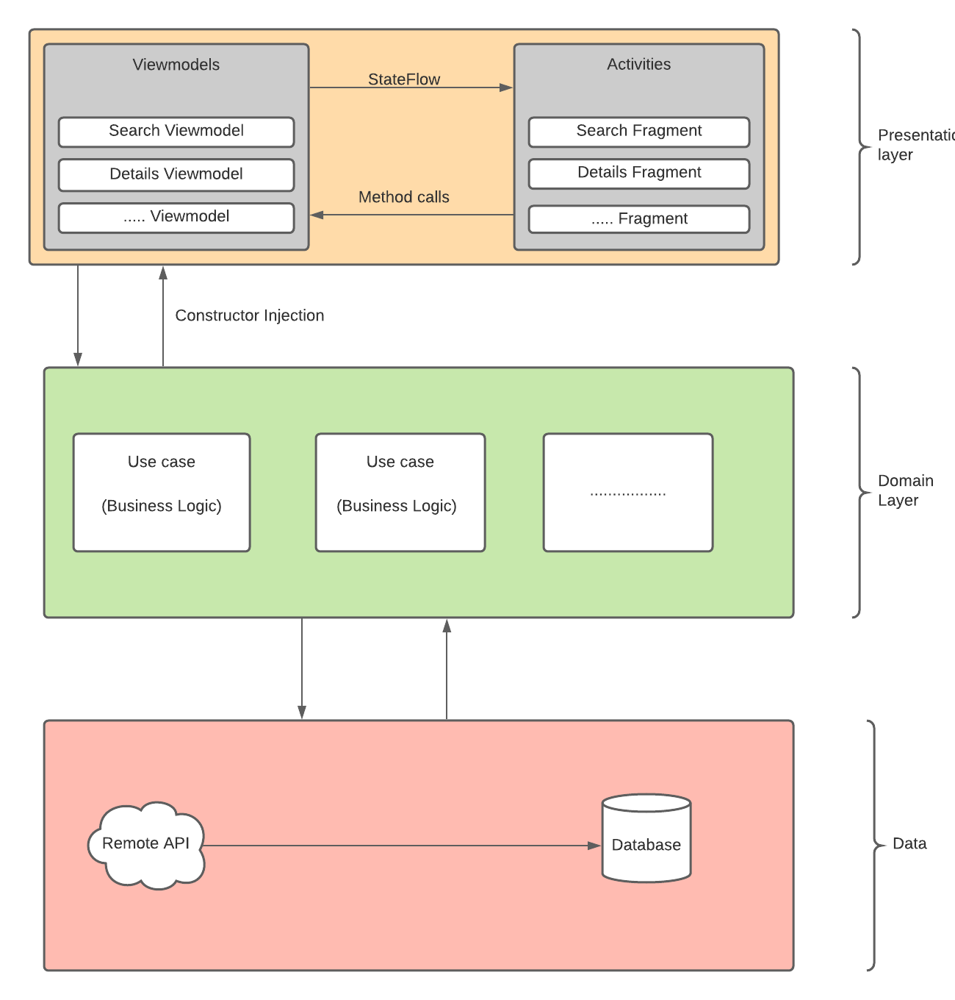
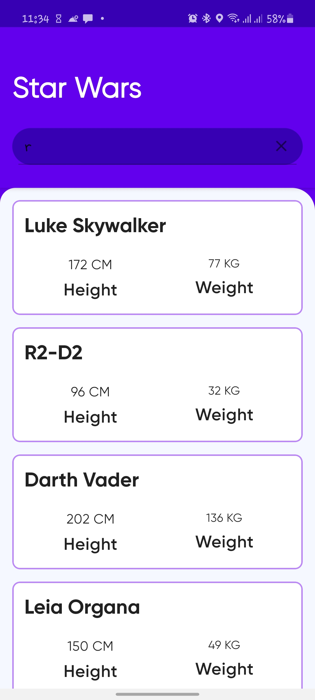
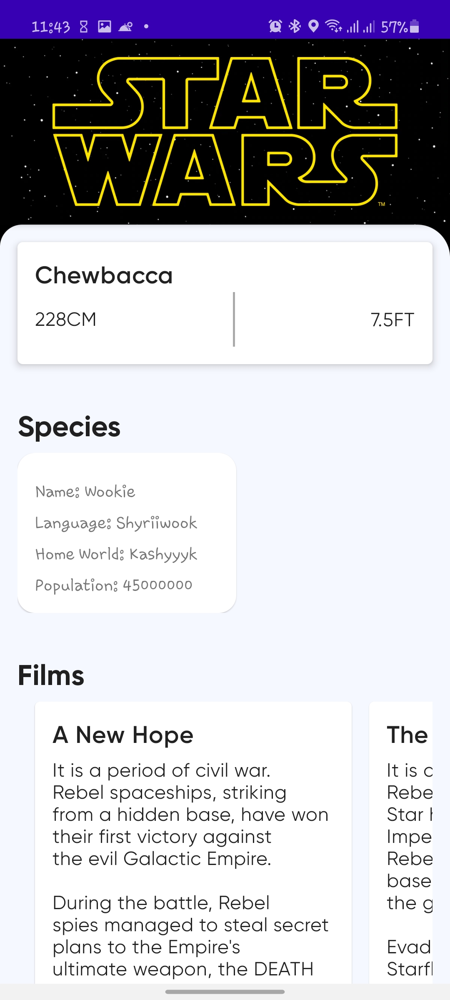

# Star Wars Search

An application that searches for starwars characters, it fetches data from [https://swapi.dev/](https://swapi.dev/)

## Architecture and data flow



The application uses a layered architecture approach to achieve separation of concern, I divided the application into the following modules: 

  

1. **buildSrc**: This is the module that handles dependency management across all modules in the application
2. **core**: This provides all resources and code that might be used by different modules in the application, such as app **icons**, **utils** and **base classes** etc..
3. **local**: This is use to handle local data manipulations or storage, this includes **databases** and **shared preference** management
4. **remote**: Fetches and manipulate data that comes from the internet it contains libraries such as **retrofit**, **gson** etc.. 
5. **presentation**: The user-facing module of the application, it provides layout files and the activities and fragment classes that make use of them
6. **Domain**: Contains **usecases** that represents a single action a user can perform(such as saving a character or searching for a character), it also defines business logics as interfaces which are implemented by the data manipulation layers(such as **local** or **remote**)

### Data In-flow

How data flows into the data sources(**Remote** or **Local**)

1. Data flow in a bi-directional and consistent manner, a user makes an action(such as typing in the search bar) in a fragment. 
2. This action(and data) is passed into the view models, which communicates with the usecases.
3. Usecases then communicates with the data layer implementation(remote and local) to fetch data from the corresponding source 

### Data Out-flow

How data flows out of the data sources into the UI(**Presentation**)

1. Data moves from the data layer implementation(remote and local) into the usecases
2. Usecases transmits this data into the viewmodels 
3. The viewmodels then send this data into kotlin state flows
4. The Activity or fragments observes this state flow when it is in the **started** lifecycle, updated data are sent though the state flow which then updates the UI

## Software design desicions

As a way to simplify the app, it only have 2 screens namely: 

### Search Fragment



I used ***flow bindings*** with the search bar to receive data as stream as the user types, that way I can easily perform some operations on how the data is emitted and how the data is received.

Then i make api calls using this data, then display the results on the recyclerview.

### Details Fragment



Building the details screen brought some challenges, these challenges were as a result of data in form of ***URLs w***hich means i have to fetch data from the server before I can display it.

### Challenge

The specification is to display the following data 

- name
- birth_year
- height (in cm and feet/inches)
- name (species)
- language (species)
- homeworld (species)
- population (planets)
- films (movies the character appeared in)
- opening_crawl (detailed description of each movie)

However, the data that is available(result of the previous api call is)

```json
{
            "name": "Chewbacca",
            "height": "228",
            "mass": "112",
            "hair_color": "brown",
            "skin_color": "unknown",
            "eye_color": "blue",
            "birth_year": "200BBY",
            "gender": "male",
            "homeworld": "http://swapi.dev/api/planets/14/",
            "films": [
                "http://swapi.dev/api/films/1/",
                "http://swapi.dev/api/films/2/",
                "http://swapi.dev/api/films/3/",
                "http://swapi.dev/api/films/6/"
            ],
            "species": [
                "http://swapi.dev/api/species/3/"
            ],
            "vehicles": [
                "http://swapi.dev/api/vehicles/19/"
            ],
            "starships": [
                "http://swapi.dev/api/starships/10/",
                "http://swapi.dev/api/starships/22/"
            ],
            "created": "2014-12-10T16:42:45.066000Z",
            "edited": "2014-12-20T21:17:50.332000Z",
            "url": "http://swapi.dev/api/people/13/"
        }
```

Some quick observation is that i can't get the list of films directly from the data, i need to make an api call to get each film, same goes for species

### Solution

I solved this by transforming the list of **URLs** into a flow, that way i can easily transform the data by using **map** or **flatmapConcat** on each of the **URL, onEach url** i then made an api call to get the data(film or species), i also did this same process to get the **homeworld,** all these is abstracted from the **presentation layer** because they where implemented in the **remote layer**

I also used a recycler view with different view types to display the data, in addition, each **view type manages its own states (loading, error, success)**

## Libraries

- **Retrofit**: This offers a flexible way to make api calls
- **Gson**:  Json parser
- **Flow Binding**: To convert data from views into coroutine flows
- **Dagger Hilt**: For dependency injection
- **Room**: Data Persistence
- **Architecture components**: Navigation
- **Truth**: For assertions
- **Konveyor**: Random test data generator

### Possible improvements

- Write UI tests using esspresso
- The main feature of the application is  **search**, so as the application grows, there might be a need to move the details fragment into a separate module(most likely an install-time feature module), this will improve the separation of concerns